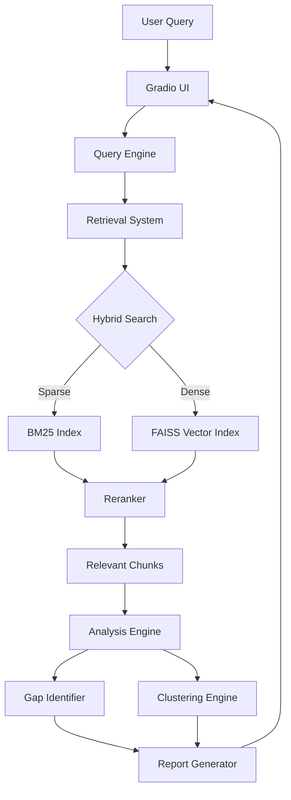

# Architecture & Data Flow

## High-Level Architecture

ORE follows a monolithic modular architecture where components communicate via direct Python function calls rather than microservice HTTP requests. This ensures low latency and simplifies state management for the complex data pipelines.

## Data Pipeline

The system processes data in distinct phases:

### 1. Ingestion Layer (`core/ingestion`)
*   **Input:** Raw PDF files or Text.
*   **Normalization:** Text is normalized using NFKC forms, accent stripping, and whitespace collapsing.
*   **Chunking:** Documents are split into semantic chunks based on sections (e.g., Abstract, Introduction) and token limits.
*   **Hashing:** A SHA-256 hash is generated for every paper and chunk to ensure content-addressable uniqueness.

### 2. Storage Layer (`database.py`)
*   **Metadata:** Stored in SQLite (`papers`, `chunks`, `entities` tables).
*   **Indices:**
    *   **In-Memory:** BM25 Index for fast keyword search.
    *   **Disk-Backed:** FAISS Index for dense vector search (`faiss_index.bin`).

### 3. Retrieval Layer (`core/retrieval`)
*   **Query Processing:** The user's query is tokenized and embedded.
*   **Execution:** Parallel execution of Sparse and Dense searches.
*   **Fusion:** Results are merged and re-scored (though currently, a simple top-k merge strategy is often used).

### 4. Analysis Layer (`core/analysis`)
*   **Clustering:** Retrieved chunks are grouped into topic clusters using K-Means on TF-IDF vectors.
*   **Gap Identification:** Entities (Methods/Datasets) are extracted and mapped to a co-occurrence matrix to find "zero-shot" gaps.

## Component Interaction

*   **Monolithic State:** The `SessionLocal` from SQLAlchemy manages database transactions across all modules.
*   **Config Management:** A central `config.py` handles paths and environment settings, ensuring all modules reference the same filesystem locations.
*   **Error Handling:** The system relies on Python's exception handling, with critical failures logging to stderr and UI-facing errors bubbling up to Gradio.
