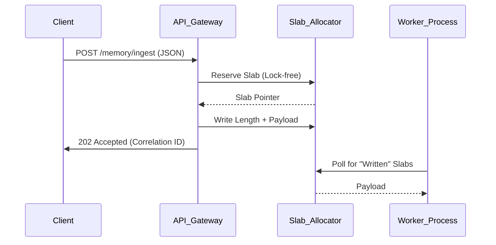

# Architectural Layers: A Deep Dive

The **Memory Thread** architecture is designed as a biological mimic, moving away from standard CRUD applications towards a "Nervous System" model. It is composed of four distinct layers, each with specific responsibilities and isolation boundaries.

## 1. The API Gateway (The Senses)
*   **Location:** `memory_thread/api/`
*   **Role:** The system's interface with the outside world (LLMs, Users, Agents).
*   **Key Component:** `IngestService`

The Gateway is "dumb" by design. It does not attempt to understand the data; it only validates its shape and stamps it with a receipt.

### The "Smart Ingestion" Protocol
Unlike standard REST APIs that block until data is saved to a database, the Gateway uses a **Length-Header Protocol** to push data immediately into shared memory.

## 2. The Service Layer (The Brain)
*   **Location:** `memory_thread/services/`
*   **Role:** Processing, Logic, and Derivation.

This is where the raw sensory input is converted into "Meaning."

### Key Services:
1.  **TMSService (Truth Maintenance System):**
    *   The core logic engine.
    *   Calculates `TruthVector` scores.
    *   Decides if a new fact (Event) overrides an old fact (State).
    *   *Code:* `memory_thread/services/tms_service.py`

2.  **StateDerivationService:**
    *   A pure function $S_{t+1} = f(S_t, E)$.
    *   Applies `DeltaPatch` (JSON Diff) to entity states.
    *   Handles arithmetic for numeric fields (e.g., `tree_count += 5`).

3.  **MetaStabilityService (The Immune System):**
    *   Runs *before* the TMS to check for "viruses" (contradictions, hallucinations).
    *   Checks "Drift" (is the topic changing too fast?).
    *   Checks "Integrity" (are values negative that shouldn't be?).
    *   *Code:* `memory_thread/services/meta_stability_service.py`

## 3. The Nervous System (The Messaging Fabric)
*   **Location:** `memory_thread/nervous/`
*   **Role:** Connecting the brain to the muscles (Storage) without latency.

This layer uses a **Dual-Path Architecture**:

1.  **The Fast Path (Reflexes) - ZeroMQ:**
    *   **Protocol:** `ROUTER/DEALER` pattern.
    *   **Why:** Microsecond latency. No broker overhead.
    *   **Usage:** Moving data from Ingestion Workers to the Persistence Engine.
    *   **Backpressure:** Implements a "Traffic Light" system. If the database is slow, the fabric signals the producers to slow down (Sleep), preventing OOM crashes.
    *   *Code:* `memory_thread/nervous/fabric.py`, `queue_manager.py`.

2.  **The Durable Path (Memory Consolidation) - Kafka:**
    *   **Protocol:** Pub/Sub.
    *   **Why:** Disk-based durability. If the server crashes, the event log remains.
    *   **Usage:** "Mirroring" every event to a durable log for later replay.
    *   *Code:* `memory_thread/nervous/fabric.py` (Class `KafkaMirror`).

## 4. The Persistence Layer (The Hippocampus)
*   **Location:** `memory_thread/db/`
*   **Role:** Long-term storage and index retrieval.

We employ a **Hybrid Storage Strategy**:

### A. The Event Log (Postgres)
*   **Table:** `events`
*   **Role:** The absolute source of truth. An append-only log of every interaction.
*   **Schema:** Immutable JSONB.

### B. The Entity State (Postgres)
*   **Table:** `entity_state`
*   **Role:** A cache of the "Now."
*   **Schema:** `current_value` (JSONB) + `truth_vector`.
*   **Logic:** This table can be deleted and fully rebuilt from the Event Log at any time (Replay).

### C. The Vector Store (Qdrant)
*   **Collection:** `memories`
*   **Role:** Associative memory. "Find me things *like* this."
*   **Schema:** High-dimensional float vectors + Payload (Metadata).

---

## 5. Data Structure Definitions

### 5.1 The Event Object
The atomic unit of memory.
*   **ID:** UUID4 (Unique Identifier)
*   **Timestamp:** UTC Datetime
*   **Actor:** Enum (`USER`, `AGENT`, `SYSTEM`)
*   **Action:** Enum (`PLANT`, `ADD`, `REMOVE`, `UPDATE`, `OBSERVE`, `INFER`)
*   **Object ID:** UUID (The entity being acted upon)
*   **Delta:** JSON Dictionary (The change payload)
*   **Truth Vector:** Embedded `TruthVector` object

### 5.2 The Truth Vector
The tensor of validity.
*   **Confidence:** Float [0.0 - 1.0]
*   **Authority:** Float [0.0 - 1.0]
*   **Freshness:** Float [0.0 - 1.0]
*   **Corroboration:** Float [0.0 - inf)
