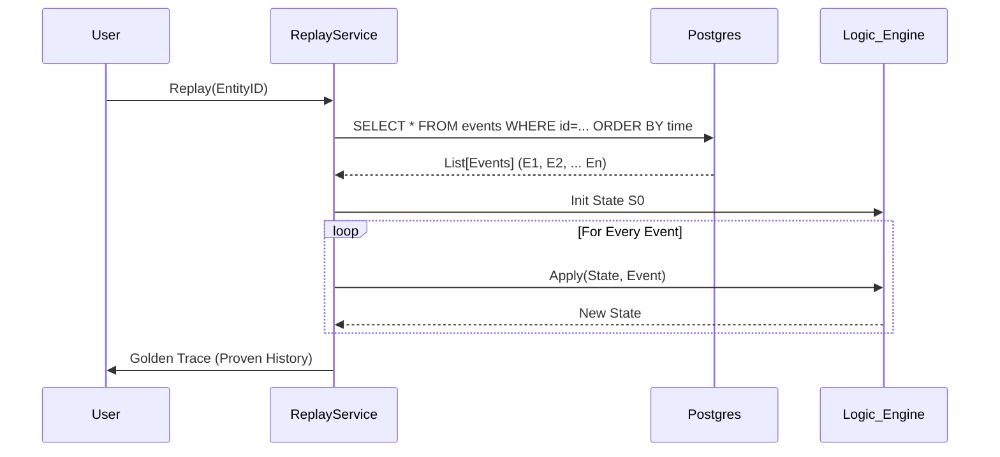

# Functional Workflows: A Technical Deep Dive

## 1. The Ingestion Workflow (The Hot Path)

This is the most performance-critical path in the system. It handles the intake of raw data and its conversion into a structured Event.

**Algorithm:**
1.  **Receive Request:** API accepts `POST /ingest` with payload $P$.
2.  **Slab Allocation (Lock-Free):**
    *   `allocator.reserve_slab()` pops an index $i$ from the free stack.
    *   If stack is empty, return 503 (Backpressure).
3.  **Binary Write:**
    *   Compute length $L = \text{len}(P)$.
    *   Write 4-byte header: `struct.pack('!I', L)`.
    *   Write $L$ bytes of $P$ to `shared_memory[i*size + 4]`.
    *   Set `metadata[i] = WRITTEN`.
4.  **Async Response:** Return HTTP 202 to client immediately.
5.  **Worker Processing:**
    *   Worker loop scans for `metadata[i] == WRITTEN`.
    *   **Deserialization:** Read $L$, decode bytes to JSON.
    *   **Drift Check:** `MetaStabilityService.check_drift(content)`.
    *   **Event Creation:** `TMSService.create_event(delta=content)`.
        *   Assign UUID, Timestamp.
        *   Init TruthVector $(1, 1, 1, 0)$.
    *   **State Derivation:** $S_{new} = \text{Apply}(S_{old}, E)$.
    *   **Release Slab:** `allocator.release_slab(i)`.
6.  **Persistence Push:** Send $(E, S_{new})$ to `PersistenceEngine` via ZeroMQ.

## 2. The Retrieval Workflow (Hybrid Search)

Retrieval is not a simple database lookup; it is a reconstruction of knowledge.

**Algorithm:**
1.  **Query Analysis:** Input query $Q$.
2.  **Vector Search (Recall):**
    *   Embed $Q \rightarrow V_q$.
    *   Query Qdrant: `search(collection="memories", vector=V_q, limit=100)`.
    *   Result set $R_{vec} = \{ (doc_i, score_i) \}$.
3.  **Graph Filtering (Precision):**
    *   Extract entities $E_q$ from $Q$.
    *   Query Graph: Find neighbors $N(E_q)$.
    *   Filter $R_{vec}$: Keep $doc_i$ only if $doc_i$ relates to $N(E_q)$.
4.  **Truth Ranking (Trust):**
    *   For each candidate $d \in R_{filtered}$:
    *   Calculate $S = w_1 C_d + w_2 A_d + w_3 F_d + w_4 \log(1 + R_d)$.
    *   Sort by $S$ descending.
5.  **Response:** Return top $k$ results.

## 3. The Replay Workflow (Time Travel)

This is the "Crown Jewel" feature for debugging and correctness.

**Algorithm:**
1.  **Initialize:** Create empty state $S_{sim} = \emptyset$.
2.  **Fetch Log:** `SELECT * FROM events WHERE object_id=X ORDER BY timestamp ASC`.
    *   Result stream $E = [e_0, e_1, \dots, e_n]$.
3.  **Simulation Loop:**
    *   For $i = 0$ to $n$:
    *   $S_{sim} \leftarrow \text{StateDerivationService.apply}(S_{sim}, e_i)$.
4.  **Verification:**
    *   Fetch actual current state $S_{db}$ from `entity_state`.
    *   Compute Diff $D = |S_{sim} - S_{db}|$.
    *   If $D > \epsilon$ (where $\epsilon = 1e-6$), raise `StateCorruptionError`.

## 4. The Maintenance Workflow (Sleep Cycle)

This runs in the background (like sleep) to optimize storage.

**Algorithm:**
1.  **Decay Pass:**
    *   For each memory $M$:
    *   Update $M.freshness = M.freshness \cdot e^{-\lambda \Delta t}$.
2.  **Pruning Pass:**
    *   If $S(M) < \text{Threshold}_{prune}$ (0.1):
    *   Mark $M$ as `ARCHIVED`.
3.  **Assimilation Pass:**
    *   Identify cluster $C = \{e_1, \dots, e_k\}$ where $\text{similarity}(e_i, e_j) > 0.9$.
    *   Generate Summary $E_{sum} = \text{LLM}(\text{Summarize}(C))$.
    *   Assign $E_{sum}.timestamp = \max(e_k.timestamp)$.
    *   Write $E_{sum}$ to Event Log.
    *   Soft-delete original cluster $C$.
